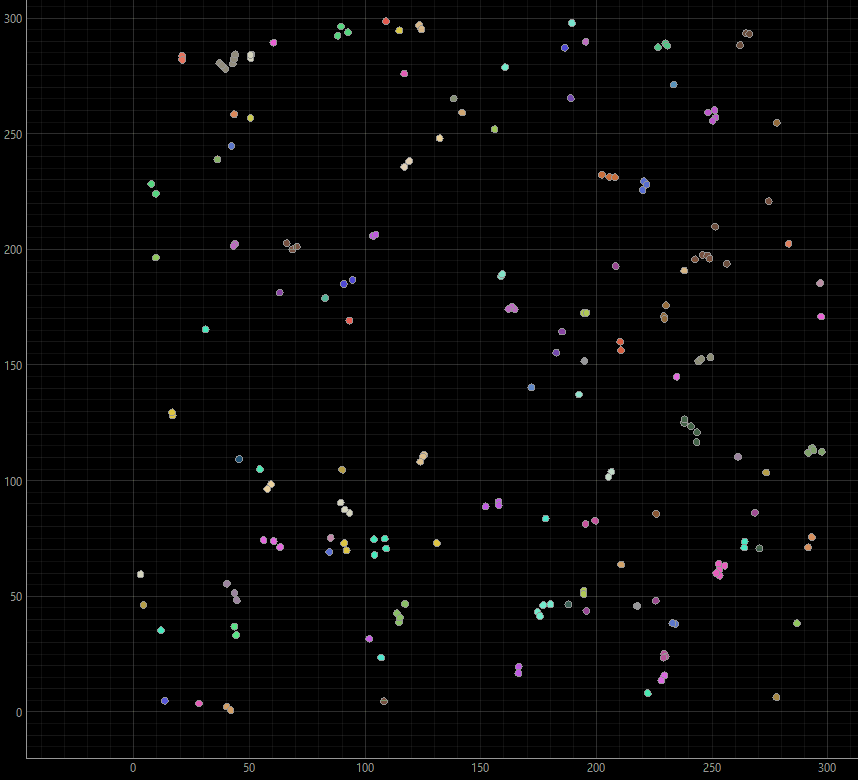

# 🕊️ Boid Flockers — Agent-Based Modeling Showcase

**Boid Flockers** demonstrates how simple, local interaction rules among agents (boids) can produce complex collective motion such as flocking, schooling, or swarming.  
This project implements the Boids model in **Mesa 2.4**, with an optional **custom PyQtGraph visualization** that highlights dynamically detected swarms based on proximity.

## 🎯 Overview

The model simulates a population of boids (agents) moving in a continuous 2D environment.  
Each boid follows three simple behavioral rules:

1. **Separation** — avoid crowding nearby agents.  
2. **Alignment** — steer toward the average heading of neighbors.  
3. **Cohesion** — move toward the average position of nearby agents.

Despite the simplicity of these rules, the system exhibits **emergent flocking behavior**, where cohesive, lifelike swarms appear without any central coordination.

## 🧠 Theoretical Background

- **Craig W. Reynolds (1987).**  
  *Flocks, Herds, and Schools: A Distributed Behavioral Model.*  
  *ACM SIGGRAPH '87 Conference Proceedings*, 21(4):25–34.  
  [[Wikipedia Summary]](https://en.wikipedia.org/wiki/Boids)

Boids are a foundational model in artificial life and collective behavior research.  
They illustrate how **complex patterns emerge from decentralized local interactions** — a key concept shared across biological, robotic, and social systems.


## 🧩 Implementation Details

### Mesa 2.4 (Classic)
- Built using the **legacy Mesa visualization** system (`ModularServer` + JavaScript canvas).
- Simple continuous space model.
- Adjustable parameters for population size, vision, speed, and separation distance.

```python
# Example (server.py)
from mesa.visualization.ModularVisualization import ModularServer
from SimpleContinuousModule import SimpleCanvas
from model import BoidFlockers

def boid_draw(agent):
    return {"Shape": "circle", "r": 2, "Filled": "true", "Color": "Red"}

boid_canvas = SimpleCanvas(boid_draw, 500, 500)
params = dict(population=100, width=100, height=100, speed=5, vision=10, separation=2)

server = ModularServer(BoidFlockers, [boid_canvas], "Boid Flockers", params)
````

### Mesa 3.x (Modern Solara)

Mesa 3.x replaces the browser-based JS visualization with the **Solara** frontend.
If you are using Mesa ≥ 3.0, refer to the official [Boid Flockers Example](https://mesa.readthedocs.io/stable/examples/basic/boid_flockers.html).


## 🎨 Custom PyQtGraph Visualization

A fully standalone, desktop-based viewer implemented using **PyQt6 + PyQtGraph**.

* Faster rendering than browser-based canvas.
* Uses a distance-based clusterer to **color-code dynamic flocks (swarms)**.
* Allows real-time stepping via a `QTimer`.

Run with:

```bash
python run_pyqt.py
```

Example viewer snippet:

```python
viewer = BoidQtViewer(model=model, fps=30, point_size=8.0, swarm_radius=6.0)
viewer.show()
```

### Visualization Example



*Figure:* Boids simulated in Mesa with dynamic swarm coloring using a proximity-based clusterer (radius = 6.0).
Over time, the boids self-organize into distinct flocks that move cohesively across the environment.

## ⚙️ Key Parameters

| Parameter         | Description                                     | Typical Effect                                 |
| ----------------- | ----------------------------------------------- | ---------------------------------------------- |
| `population`      | Number of boids                                 | Higher values increase density and interaction |
| `width`, `height` | Environment size                                | Controls encounter frequency                   |
| `speed`           | Step speed                                      | Controls movement responsiveness               |
| `vision`          | Neighbor detection radius                       | Affects alignment and cohesion                 |
| `separation`      | Minimum distance between boids                  | Prevents overcrowding                          |
| `swarm_radius`    | Radius for dynamic cluster coloring (PyQtGraph) | Defines how close boids must be to share color |

## 📦 Installation

```bash
# Clone repository
git clone https://github.com/amartaivan-s/abms.git
cd abms/boids_flockers

# Recommended for Mesa 2.4
pip install mesa==2.4 pyqt6 pyqtgraph numpy
```

> For Mesa ≥ 3.0, adapt the model using Solara-based visualization.

## 🧭 Folder Structure

```
boids_flockers/
│
├── model.py                # Core Mesa model (agents, environment, scheduler)
├── SimpleContinuousModule.py
├── server.py               # Classic Mesa visualization (JS)
├── run_pyqt.py             # Launcher for PyQtGraph version
├── view_pyqt.py            # PyQtGraph viewer (dynamic swarm coloring)
└── README.md               # This file
```

## 🔗 References

* [Mesa 3.x Boid Flockers Example](https://mesa.readthedocs.io/stable/examples/basic/boid_flockers.html)
* [Boids (Wikipedia)](https://en.wikipedia.org/wiki/Boids)
* [Mesa Framework Documentation](https://mesa.readthedocs.io/en/stable/)

## 🧩 Author

**Sanjjamts Amartaivan**
[amartaivan-s.github.io](https://amartaivan-s.github.io)

*Part of the [ABMS Interactive Showcases](https://amartaivan-s.github.io/abms/) series.*


